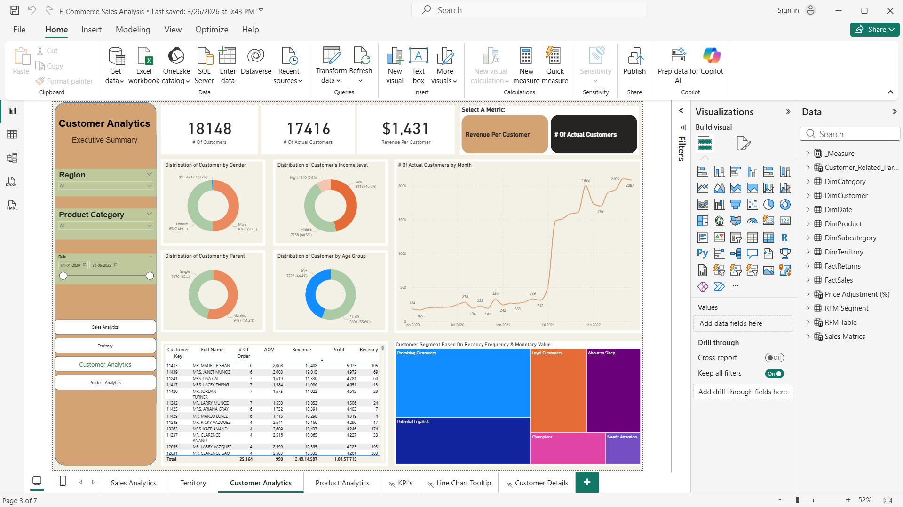

# 🛒 E-Commerce Sales Analysis Dashboard

## 📌 Overview
End-to-end data analytics project analyzing 9,800+ e-commerce orders 
spanning 2015–2018, built using Python and Power BI.

## 🛠️ Tools & Technologies
- **Python (Pandas)** — Data Cleaning & Transformation
- **Power BI** — 7-page Interactive Dashboard
- **Excel** — Raw Data Source
- **RFM Analysis** — Customer Segmentation

## 📊 Dashboard Preview

## 📁 Project Files
| File | Description |
|------|-------------|
| `Data_Cleaning.py` | Python script for data cleaning |
| `train.xlsx` | Raw dataset |
| `cleaned_data.csv` | Processed dataset |
| `E-Commerce Sales Analysis.pbix` | Power BI Dashboard |

## 📈 Key Insights
- Total Sales: $2.26M+ across 4 US regions
- 18,148 total customers | 17,416 active customers
- Average Revenue Per Customer: $1,431
- Top Category: Technology

## 👤 Author
Abhay Sharma — Solo Project (Jan 2026 – Jun 2026)